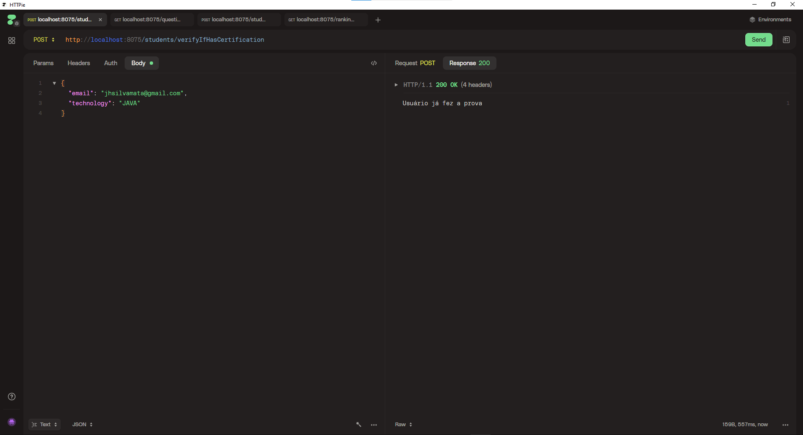
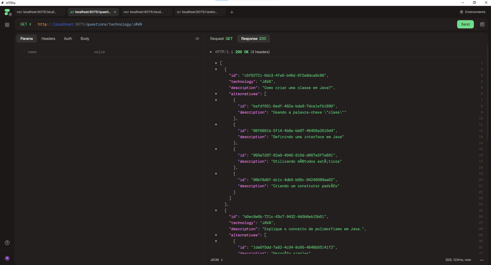
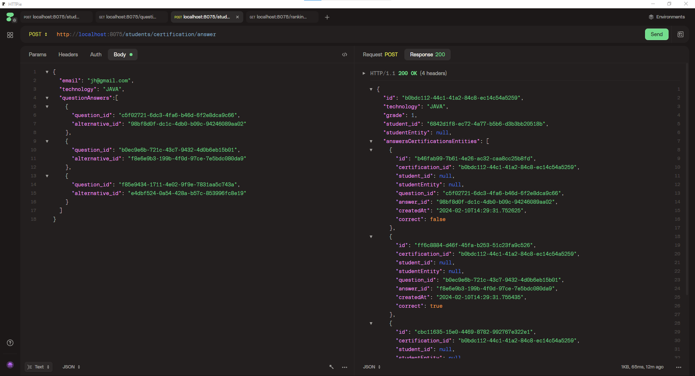
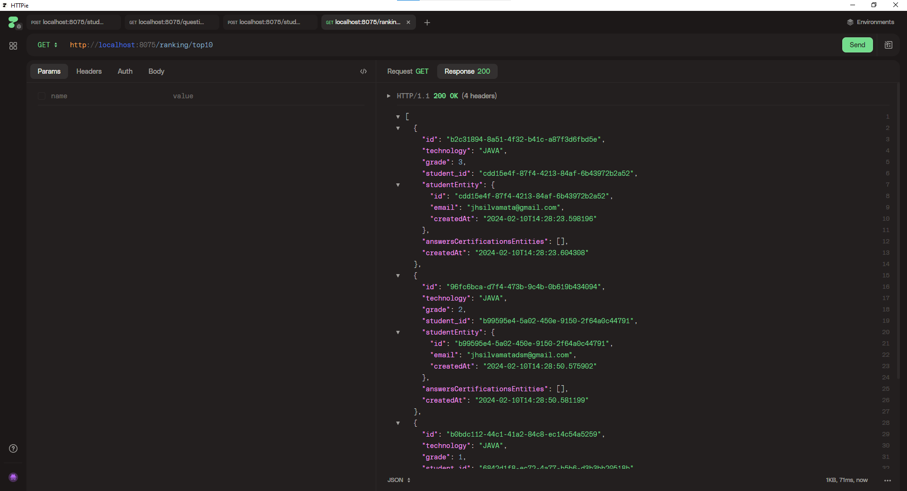

# certification-nlw
Projeto desenvolvido no NLW Expert - Java

## Tecnologias e ferramentas utilizadas
- Java 17
- Spring Boot
- Maven
- Docker
- PostgreSQL
- VS Code
- Httpie

## Endpoints
- POST: http://localhost:8075/students/verifyIfHasCertification

- GET: http://localhost:8075/questions/technology/JAVA

- POST: http://localhost:8075/students/certification/answer

- GET: http://localhost:8075/ranking/top10

## Anotations
API REST
- GET - Buscar uma informação
- POST - Inserir uma informação
- PUT - Alterar uma informação
- DELETE - Remover uma informação
- PATCH - Alterar PONTUAL de uma informação

Os tipos de parâmetros
- Body - { }
- Query Params - http://localhost:8075/users?nome=Henrique&idade=19 OPCIONAIS
- Parâmetros de rotas http://localhost:8075/users/{nome}/{idade}

ORM -> Object Relational Mapper

Repositório (Repository) -> Interagir com o banco de dados